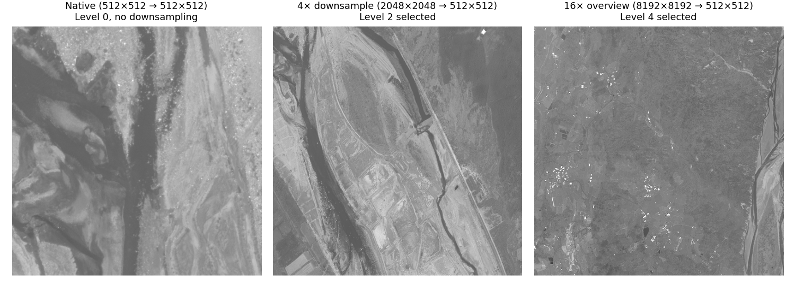
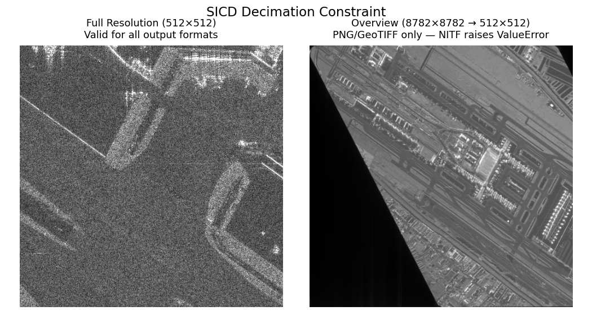

# Image Chipping

Large satellite and aerial images are rarely consumed whole. Analysts
need small regions for exploitation, ML pipelines need labeled training
patches, and downstream systems need self-contained files they can
ingest without the original collection. The toolkit's **ChipFactory**
extracts rectangular subsets from a multi-resolution pyramid, applies
optional display processing, derives geospatial metadata, and encodes
the result as a standalone image file. `ChipFactory` is safe for
concurrent `create_chip` calls from multiple threads. A call returns
`None` for sparse/empty regions, raises `ValueError` for invalid
windows or unsupported SICD scaling, and propagates encoding exceptions
from the underlying writer.

```{seealso}
- [Image Pyramids](image-pyramids.md) — building and reading the
  multi-resolution sources that ChipFactory reads from
- [Display Processing](display-processing.md) — constructing the
  processing chains that convert raw sensor data to 8-bit display
- [Image Warping](image-warping.md) — orthorectification and map tile
  generation from warped imagery
```

## Conceptual Pipeline

The chip extraction pipeline proceeds through a fixed sequence of
stages. Each stage is optional (controlled by ChipFactory
configuration), but the order is invariant:

1. **Window selection** — caller specifies a `PixelWindow` in
   full-resolution (R0) coordinates
2. **Level selection** — the factory picks the coarsest pyramid level
   that avoids upsampling for the requested `output_size`. State your
   request in R0 coordinates plus a desired output size — the factory
   handles the rest.
3. **Pixel read** — tiles are decoded from the selected level
   (band-selective when a chain specifies `input_bands`)
4. **Processing chain** — optional `ndarray -> ndarray` pipeline
   (DRA, band mapping, SAR remap) converts raw pixels to display
5. **Resample** — final resize to `output_size` (area-based for
   downsampling, bilinear for upsampling)
6. **Metadata derivation** — IGEOLO, ICHIPB, GeoTransform, or
   SICD/SIDD DES are computed from the sensor model and chip bounds
7. **Encoding** — pixels + metadata are written to an in-memory file
   via osml-imagery-io's `DatasetWriter`

Chips from the same image at different resolution levels — all three
outputs are 512×512 pixels, but the factory reads from progressively
coarser levels as the ratio between source window and output size
grows:



## Display Chip for Viewing

Apply dynamic range adjustment and band mapping to produce a
human-viewable image. Useful for thumbnails, quick-look products, or
feeding web tile servers. See [Display Processing](display-processing.md)
for chain construction details.

```python
from aws.osml.io import IO
from aws.osml.image_processing import (
    ChipFactory, DisplayChainFactory, ImageSize, PixelWindow, TiledImagePyramid,
)

with IO.open("image.ntf", "r") as reader:
    pyramid = TiledImagePyramid.from_dataset(reader)
    chain = DisplayChainFactory.build(pyramid)

    factory = ChipFactory(
        source=pyramid,
        output_format="png",
        processing_chain=chain,
    )

    # 2048x2048 source region rendered at 256x256 for a thumbnail
    chip = factory.create_chip(
        PixelWindow(0, 0, 2048, 2048),
        output_size=ImageSize(width=256, height=256),
    )
```

When a processing chain is provided:

- Band-selective reads are used if the chain specifies `input_bands`
- The chain output dtype/bands determine the encoded pixel format
- SICD/SIDD DES metadata is omitted from output (the pixels have been
  transformed and no longer match the DES geometry model)

## Raw Chip for Analysis

Preserve original pixel values and full metadata for downstream
exploitation or archival. No processing chain — the output file
contains sensor-native pixels. Pass a `sensor_model` to derive
geospatial metadata (IGEOLO, ICHIPB, DES) for the chip.

```python
from aws.osml.io import IO
from aws.osml.image_processing import ChipFactory, TiledImagePyramid, PixelWindow
from aws.osml.metadata import load_sensor_model

with IO.open("collection.ntf", "r") as reader:
    pyramid = TiledImagePyramid.from_dataset(reader)
    sensor_model = load_sensor_model(reader)

    factory = ChipFactory(
        source=pyramid,
        sensor_model=sensor_model,
        output_format="nitf",
    )

    # Full-resolution chip with IGEOLO + ICHIPB + DES metadata
    chip_bytes = factory.create_chip(PixelWindow(x=1024, y=2048, width=512, height=512))
```

The returned `chip_bytes` is a complete encoded image file that can be
written to disk or served directly.

The factory auto-selects the appropriate metadata builder based on the
output format:

- **NITF** — IGEOLO + ICHIPB + DES
- **GeoTIFF** — GeoTransform + CRS
- **PNG/JPEG** — No geospatial metadata

## Metadata Overrides

Override NITF subheader fields on the output chip. Useful for setting
compression, security markings, or other file-level metadata that
differs from the source:

```python
from aws.osml.io import BufferedMetadataProvider

overrides = BufferedMetadataProvider()
overrides.set("IC", "C8")       # JPEG 2000 compression
overrides.set("COMRAT", "V1")   # Visually lossless compression ratio
overrides.set("IREP", "MONO")   # Override image representation

factory = ChipFactory(
    source=pyramid,
    output_format="nitf",
    metadata_overrides=overrides,
)
```

Common override fields for NITF output:

| Field | Purpose | Example Values |
|-------|---------|----------------|
| `IC` | Image compression | `"NC"` (none), `"C3"` (JPEG), `"C8"` (JPEG 2000) |
| `COMRAT` | Compression ratio | `"V1"` (visually lossless), `"N2.0"` (numeric) |
| `IREP` | Image representation | `"MONO"`, `"RGB"`, `"MULTI"` |
| `ICAT` | Image category | `"VIS"`, `"SAR"`, `"IR"` |

## SAR Constraints

### SICD

A SICD product is an intermediate data product — a complex-valued pixel
grid paired with metadata that precisely describes the radar collection
geometry, image formation algorithm, and spatial frequency support. The
SICD metadata is valid only for the exact pixel sampling produced by
the image formation processor. Decimating (spatially subsampling)
complex pixels changes the effective bandwidth and sampling grid,
invalidating the metadata's description of the image. There is no
general way to update SICD metadata for a downsampled array because the
relationship between pixels and the collection geometry is destroyed.

For 1:1 chips (sub-images extracted without resampling), the factory
updates `ImageData.FirstRow`, `FirstCol`, `NumRows`, and `NumCols` in
the SICD XML — this is the only valid metadata operation. Requesting
`output_size` different from `src_window` dimensions with NITF output
raises `ValueError`.



When a processing chain is applied (e.g. `ComplexRemapFactory` converts
I/Q to display magnitudes), the output is no longer a SICD product —
the complex phase information has been irreversibly discarded. The
factory omits the SICD DES and produces a standard display image. These
display chips can be generated at any resolution since they are not
governed by the SICD standard; they are ordinary derived imagery.

### SIDD

SIDD products contain already-detected (scalar) pixels with
exploitation metadata describing the output coordinate system and
display transformations. Unlike SICD, the pixels can be spatially
resampled without violating the data model. The SIDD standard defines a
`GeometricChip` structure (NGA.STND.0025-1, Section 5.1) that maps
chip pixel coordinates back to the original full image via bilinear
interpolation of corner points — this mapping is valid at any output
resolution, so the factory can produce both 1:1 and downsampled SIDD
chips with valid metadata.

When a processing chain is applied, the DES is omitted — the pixels no
longer match the product definition described by the SIDD metadata.

```{note}
Producing a SIDD product *from* a SICD source (complex-to-detected
conversion with full exploitation metadata) is a more involved
processing pipeline that this toolkit does not implement. The display
chain produces viewable imagery from SICD data, but the result is not a
standards-compliant SIDD product.
```

