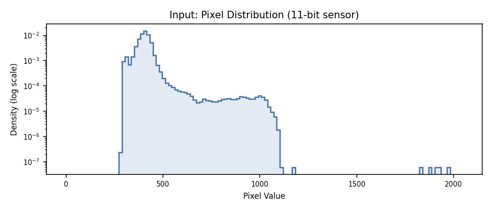
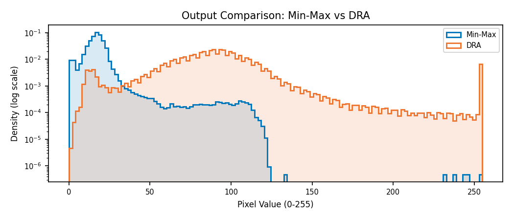
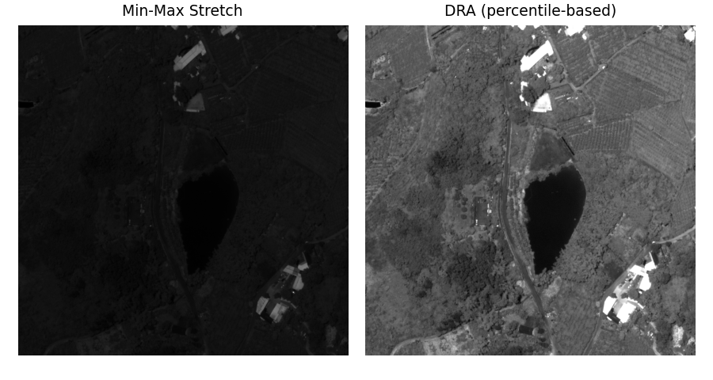
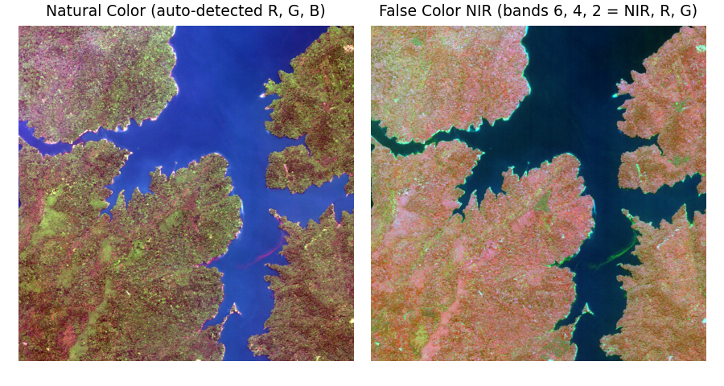
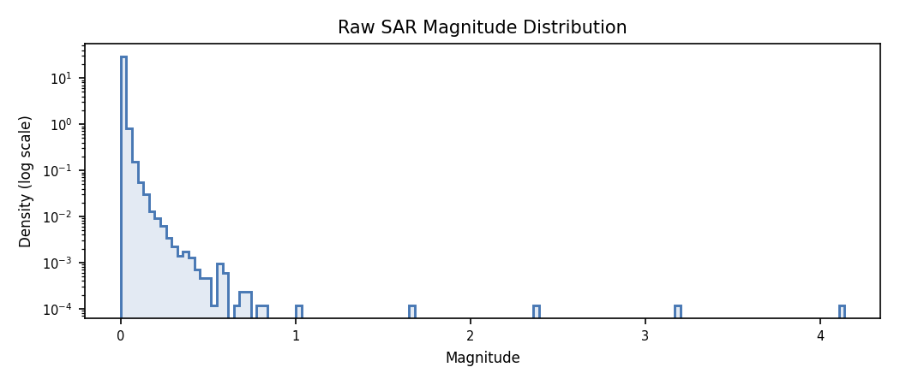
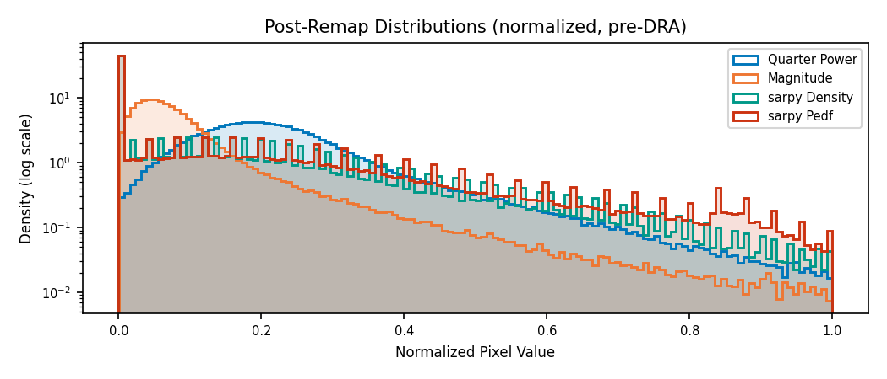
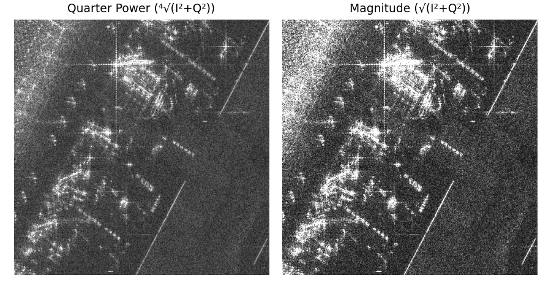
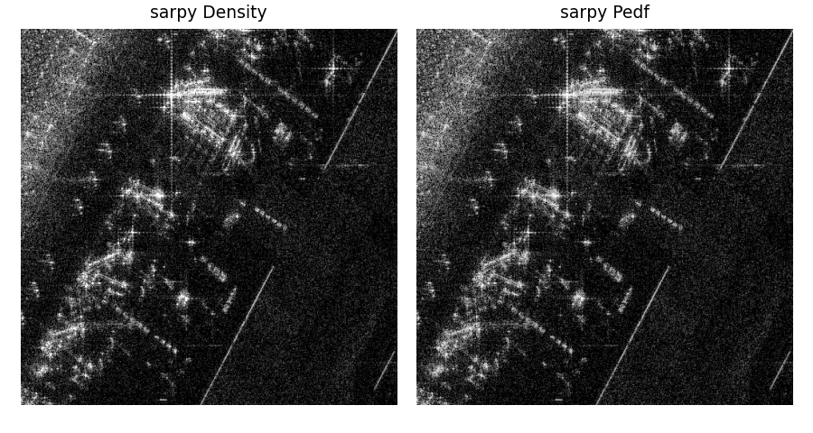

# Display Processing

Satellite imagery is not directly viewable on a standard monitor.
Electro-optical (EO) sensors capture at high bit depths (11–16 bits)
and synthetic aperture radar (SAR) sensors produce complex-valued
(floating-point I/Q) pixels. The toolkit contains pixel processing
operations needed to convert these raw measurements into 8-bit images
suitable for display.

The toolkit provides three components:

- **`ProcessingChain`** — an ordered sequence of `ndarray → ndarray`
  operations that tracks output metadata. Constructed from a list of
  callable steps along with `output_bands`, `output_dtype`, and
  optional `input_bands`. Multiple chains can be merged into one with
  `compose()`.
- **`DisplayChainFactory`** — a metadata-aware builder that inspects an
  image source and constructs the appropriate chain automatically.
  Examines NITF subheader fields (`PVTYPE`, `IREP`, `ICAT`, `ISUBCAT`)
  and GeoTIFF tags to classify image modality, select band mappings,
  and configure dynamic range adjustment.
- **`MappedImageProvider`** — wraps a source asset and applies a
  processing chain to every block on read. Accepts `source_bands`
  (which bands to decode from the source) and `num_bands` (output band
  count) so only the required data is fetched and transformed. An
  optional `TileCache` avoids redundant processing for repeated block
  requests.

## Quick Start

```python
from aws.osml.io import IO
from aws.osml.image_processing import DisplayChainFactory, MappedImageProvider

with IO.open("image.ntf", "r") as reader:
    source = reader.get_asset("image:0")

    # Build the display chain (auto-detects modality, band count, etc.)
    chain = DisplayChainFactory.build(source)

    # Wrap the source with the chain for block-level display
    display = MappedImageProvider(
        source, chain,
        source_bands=chain.input_bands,
        num_bands=chain.output_bands,
    )

    # Read display-ready blocks
    tile = display.get_block(0, 0)  # uint8 output
```

The factory examines NITF subheader fields (`PVTYPE`, `IREP`, `ICAT`,
`ISUBCAT`) and GeoTIFF tags to classify the image modality and select
the correct processing steps.

## Dynamic Range Adjustment

DRA maps the sensor's wide pixel range to the 8-bit (0–255) display
range by computing boundaries from cumulative histogram percentiles
(default: 2nd and 98th). Pixels outside these boundaries are allowed
to clip, and the interior is linearly mapped to fill the output range.

```python
# Factory auto-detects and applies DRA (default)
chain = DisplayChainFactory.build(source)

# Explicit DRA
chain = DisplayChainFactory.build(source, range_adjustment="dra")

# Simple min-max stretch (no outlier handling)
chain = DisplayChainFactory.build(source, range_adjustment="minmax")
```

### Input Distribution

Panchromatic sensors capture light across the entire visible spectrum
(roughly 450–900 nm) in a single broadband channel. Because all
wavelengths contribute to one measurement, the sensor collects more
photons per pixel than any individual spectral band — yielding the
highest spatial resolution of the satellite's imaging modes. The
resulting image is a single-band grayscale intensity map.

The following histogram shows pixel distribution from a single-band
panchromatic satellite tile (11-bit effective dynamic range stored as
uint16). The data occupies a narrow region in the lower portion of the
available 0–2047 range.



### Min-Max vs. DRA Output

Min-max stretch maps from the actual minimum to maximum pixel value.
Outliers (specular reflections, dead pixels) dominate the mapping and
compress the bulk of scene content into a narrow output band. DRA
ignores those outliers via histogram percentiles and dedicates the full
0–255 range to the scene's dominant content.





## Band Selection

Multispectral sensors divide the electromagnetic spectrum into discrete
bands — typically 4–12 channels spanning visible, near-infrared (NIR),
and shortwave infrared (SWIR) wavelengths. Each band isolates a narrow
spectral window (e.g. 630–690 nm for red, 770–895 nm for NIR),
enabling analysis of material properties invisible to the human eye.
Hyperspectral sensors take this further, sampling hundreds of
contiguous bands at ~10 nm intervals to produce a near-continuous
spectrum per pixel.

A standard monitor has only three channels (red, green, blue), so
displaying an N-band image requires selecting which three source bands
map to the RGB output. The choice determines what information is
visible:

- **Natural color** assigns red, green, and blue bands to their
  respective display channels — producing an image that approximates
  what a human would see from orbit.
- **False color composites** assign non-visible bands (NIR, SWIR) to
  display channels, revealing features like vegetation health (NIR
  appears bright for photosynthetically active canopy) or moisture
  content that are invisible in natural color.

The factory auto-detects RGB band assignments from metadata (NITF
`IREPBAND`, GeoTIFF `PhotometricInterpretation`, BANDSB TRE
wavelengths). Override with `band_selection`:

```python
# Natural color from an 8-band multispectral sensor
chain = DisplayChainFactory.build(source, band_selection=(4, 2, 1))

# False color NIR composite
chain = DisplayChainFactory.build(source, band_selection=(6, 4, 2))
```



The selected bands are stored in `chain.input_bands` — pass this to
`MappedImageProvider` so only the required bands are decoded from the
source:

```python
display = MappedImageProvider(
    source, chain,
    source_bands=chain.input_bands,  # Only decode needed bands
    num_bands=chain.output_bands,
)
```

## SAR Complex Imagery

SAR sensors produce complex-valued pixels — each pixel carries an
in-phase (I) and quadrature (Q) component representing the amplitude
and phase of the radar return. These complex values cannot be displayed
directly; they must be converted to scalar magnitudes suitable for
rendering on a monitor.

The fundamental challenge is dynamic range. A SAR scene's dynamic
range — from the noise floor to the brightest discrete scatterer — can
exceed 100 dB. The human visual system perceives only 30–40 dB of
tonal variation, and an 8-bit display encodes at most 48 dB. Pixel
magnitudes of distributed clutter follow a Rayleigh distribution: most
energy concentrates at low amplitudes while discrete targets (buildings,
vehicles, corner reflectors) produce returns orders of magnitude
brighter.



A nonlinear remap compresses the scene's dynamic range into the
perceivable range so that clutter structure — the low-level detail an
analyst needs for exploitation — becomes visible while bright discrete
targets remain distinguishable. Different remap functions make different
tradeoffs between compression strength, detail preservation in the
clutter, and noise visibility.



The toolkit handles this with a two-step workflow:

1. **Detect and remap** complex sources to scalar magnitudes using a
   nonlinear compression function.
2. **Build the display chain** on the remapped data — the factory treats
   it identically to any EO image for final DRA and quantization.

```python
from aws.osml.io import IO
from aws.osml.image_processing import (
    ComplexRemapFactory,
    DisplayChainFactory,
    MappedImageProvider,
    is_complex,
    load_complex_remap,
)

with IO.open("sicd_image.ntf", "r") as reader:
    source = reader.get_asset("image:0")

    if is_complex(source):
        # Option A: auto-extract metadata from reader (SICD DES, NITF subheader)
        remapped = load_complex_remap(reader, asset_key="image:0")

        # Option B: explicit factory with known band interpretation
        remapped = ComplexRemapFactory.build(
            source,
            band_interpretation=["real", "imaginary"],
            remap="quarter_power",
        )
    else:
        remapped = source

    # Build DRA chain on scalar data (same as EO)
    chain = DisplayChainFactory.build(remapped)
    display = MappedImageProvider(
        remapped, chain,
        source_bands=chain.input_bands,
        num_bands=chain.output_bands,
    )
    tile = display.get_block(0, 0)  # uint8 output with correct contrast
```

```{note}
`is_complex()` is a helper that examines the pixel type and common NITF
metadata (image category, band subcategories, image representation) to
determine whether the pixels should be interpreted as complex values.
```

### Built-in Remap Presets

**`"quarter_power"`** (default)
:   Formula: $\sqrt[4]{I^2 + Q^2}$

    Compresses dynamic range via fourth-root scaling. Produces a
    roughly Gaussian distribution ideal for DRA percentile clipping.
    Best general-purpose choice — reveals scene structure while
    suppressing speckle.

**`"magnitude"`**
:   Formula: $\sqrt{I^2 + Q^2}$

    Linear magnitude. Preserves relative amplitudes but produces a
    heavy-tailed distribution that may need aggressive DRA clipping.
    Useful when relative backscatter intensity must be visually
    comparable across the scene.

Both presets return `(1, H, W)` float32 output.



### Using sarpy Remap Functions

The [sarpy](https://github.com/ngageoint/sarpy) library provides
additional remap algorithms that integrate via the custom callable
interface on `ComplexRemapFactory`:

| Algorithm | Approach | Best for |
|-----------|----------|----------|
| **Density** | Histogram equalization on magnitude | Maximum local contrast; useful for visual inspection of cluttered urban scenes |
| **NRL** | Log-scale with noise floor estimation | Balanced display with noise suppression; general-purpose alternative to quarter-power |
| **PEDF** | Piecewise-linear equalized density | Preserves detail in both bright and dark regions; good for scenes with wide brightness variation |

```python
import numpy as np
from sarpy.visualization.remap import density, nrl, pedf

def sarpy_adapter(sarpy_remap_fn):
    """Wrap a sarpy remap as a ComplexRemapFactory-compatible callable."""
    def remap(block):
        # block is (2, H, W) float32 I/Q
        complex_data = block[0].astype(np.float64) + 1j * block[1].astype(np.float64)
        display = sarpy_remap_fn(complex_data)
        return display[np.newaxis, :, :].astype(np.float32)
    return remap

remapped = ComplexRemapFactory.build(
    source,
    band_interpretation=["real", "imaginary"],
    remap=sarpy_adapter(nrl),
)
```



## Custom Processing Chains

For cases not covered by the factory, build a `ProcessingChain` directly.
Multiple chains can be merged into one with `compose()`:

```python
import numpy as np
from aws.osml.image_processing import ProcessingChain, compose

def my_preprocess(image):
    ...

def my_dra_step(image):
    ...

preprocess = ProcessingChain(
    steps=[my_preprocess],
    output_bands=3,
    output_dtype=np.dtype(np.float32),
    input_bands=(4, 2, 1),
)

dra = ProcessingChain(
    steps=[my_dra_step],
    output_bands=3,
    output_dtype=np.dtype(np.uint8),
)

chain = compose(preprocess, dra)
result = chain(raw_block)
```

