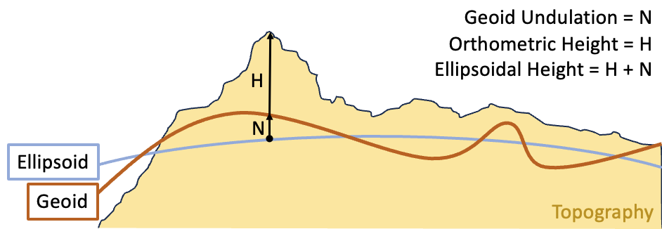

# Elevation Models

Geolocating a pixel in an overhead image requires knowing the terrain
height at that point. Without elevation data, the sensor model must
assume a flat surface — and the resulting horizontal error grows with
both the off-nadir angle and the true terrain relief.

## Ellipsoidal vs. Orthometric Height

Sensor models in this library work in **ellipsoidal heights** — meters
above the WGS84 reference ellipsoid. Most DEM sources (including SRTM)
store **orthometric heights** — meters above mean sea level (the
geoid). The difference between these datums (the *geoid undulation*)
varies from about -106 m to +85 m globally.



Always apply a geoid correction when using orthometric DEM data.
Failing to do so introduces the full geoid undulation as an elevation
error — which, at high off-nadir angles, can produce horizontal errors
exceeding 50 meters.

## Quick Start

The simplest useful configuration: SRTM terrain tiles, EGM96 geoid
correction, and a sea-level fallback for locations without DEM
coverage.

```python
from aws.osml.io import IO
from aws.osml.metadata import load_sensor_model
from aws.osml.elevation import ElevationModelBuilder, StoredDEMTileFactory
from aws.osml.photogrammetry import ImageCoordinate, SRTMTileSet

# Build the elevation model
elevation_model = (
    ElevationModelBuilder()
    .add_source(
        StoredDEMTileFactory("/path/to/srtm_tiles"),
        SRTMTileSet(),
    )
    .add_fallback(0.0)
    .with_geoid("/path/to/egm96_15.tif")
    .build()
)

# Use with a sensor model for accurate geolocation
with IO.open("image.ntf", "r") as reader:
    sensor_model = load_sensor_model(reader)
    image = reader.get_asset("image:0")
    width, height = image.num_columns, image.num_rows

world = sensor_model.image_to_world(
    ImageCoordinate([width / 2, height / 2]),
    elevation_model=elevation_model,
)
```

## The ElevationModel Interface

All elevation models implement two methods:

- **`set_elevation(world_coordinate)`** — updates the elevation
  component of a `GeodeticWorldCoordinate` in place. Returns `True`
  if the elevation was set, `False` if the model has no data at that
  location.
- **`describe_region(world_coordinate)`** — returns an
  `ElevationRegionSummary` (min/max elevation, no-data value, post
  spacing) for the area near the coordinate, or `None`.

## Using the Builder (Recommended)

`ElevationModelBuilder` composes these classes for you. It is the
recommended path for most use cases — it handles coordinate
normalization, multi-source priority ordering, and geoid correction
automatically.

| Method | Purpose |
|--------|---------|
| `.add_source(factory, tile_set, ...)` | Add a DEM source with optional spatial condition |
| `.add_elevation_model(model, ...)` | Add a pre-built `ElevationModel` as a source |
| `.add_fallback(elevation)` | Add a constant elevation as the lowest-priority source |
| `.with_geoid(path, scale_factor)` | Apply geoid undulation correction globally |
| `.build(normalize=True)` | Assemble the final model; `normalize=False` to opt out |

Sources are tried in the order they are added. The first source that
successfully provides an elevation value wins. Sources with a condition
are skipped when the condition evaluates to False for the query point.

```python
from aws.osml.elevation import (
    ElevationModelBuilder,
    ShapefileQuery,
    StoredDEMTileFactory,
)
from aws.osml.photogrammetry import SRTMTileSet, GenericDEMTileSet

local_coverage = ShapefileQuery("/path/to/local_coverage.shp")

elevation_model = (
    ElevationModelBuilder()
    # First priority: high-res local DEM (only where coverage exists)
    .add_source(
        StoredDEMTileFactory("/path/to/local_dem"),
        GenericDEMTileSet(format_spec="%ld%lh_%od%oh.tif"),
        condition=local_coverage,
    )
    # Second priority: global SRTM (no condition — used everywhere else)
    .add_source(
        StoredDEMTileFactory("/path/to/srtm_tiles"),
        SRTMTileSet(),
    )
    .add_fallback(0.0)
    .with_geoid("/path/to/egm96_15.tif")
    .build()
)
```

`SRTMTileSet` maps coordinates to USGS-style file names (e.g.,
`n38_w078_1arc_v3.tif`). `GenericDEMTileSet` supports other naming
conventions via a format string (the example above uses a
`lat_lon.tif` pattern; DTED Level 2 would be
`"dted/%od%oh/%ld%lh.dt2"`).

```{note}
Shapefiles used with `ShapefileQuery` must be properly split at the
+/-180 degree longitude antimeridian. Standard datasets (Natural Earth,
GSHHS) are already split correctly.
```

```{note}
The `.with_geoid()` correction is applied **globally** to the final
elevation result. If you mix sources with different vertical datums,
compose `OffsetElevationModel` manually around only the orthometric
source and add it via `.add_elevation_model()`.
```

```{warning}
EGM2008 at 1-arc-minute resolution requires approximately 1.8 GB of
RAM. For most applications, the 5-arc-minute grid (~75 MB) provides
sufficient accuracy. EGM96 at 15-arc-minute resolution requires only
~8 MB.
```

## Composing Models Directly

The builder is convenient but not required. You can compose the
elevation model classes directly for full control. The toolkit provides
several implementations that compose together:

| Class | Description |
|-------|-------------|
| `DigitalElevationModel` | Reads DEM raster tiles and interpolates elevation values. Requires a `DigitalElevationModelTileSet` (maps coordinates to file paths) and a `DigitalElevationModelTileFactory` (loads raster data). The `raster_cache_size` parameter controls how many decoded tiles are kept in an LRU cache. |
| `ConstantElevationModel` | Returns a fixed elevation for all coordinates. Useful as a lowest-priority fallback or for testing. |
| `MultiElevationModel` | Calls `set_elevation` on each model in order and returns the first successful result. Models that return `False` are skipped, letting the next source try. |
| `ConditionalElevationModel` | Gates an inner model behind an `ElevationModelCondition`. If the condition returns `False`, `set_elevation` returns `False` and the coordinate is unchanged — allowing a `MultiElevationModel` to fall through to the next source. |
| `OffsetElevationModel` | Wraps an inner model and adds a datum offset after elevation is set. Use with `RasterOffsetProvider` (interpolates from a geoid undulation raster) or `ConstantOffsetProvider` (fixed offset everywhere). |
| `NormalizedElevationModel` | Normalizes longitude/latitude before delegating to an inner model. |

### Conditions

`GeometryCondition` connects an `ElevationModelCondition` to a
`GeometryQuery` — it evaluates `True` when the query point falls
inside a geometry returned by the query. `ShapefileQuery` is the
built-in `GeometryQuery` implementation. Pass `invert=True` to match
points *outside* the geometry instead. For non-spatial conditions,
subclass `ElevationModelCondition` and implement `is_true()`.

### Example: Multi-Source with Shoreline Masking

High-res local DEM where coverage exists, global SRTM on land
elsewhere, zero over water, with geoid correction applied globally:

```python
from aws.osml.photogrammetry import (
    ConditionalElevationModel,
    ConstantElevationModel,
    DigitalElevationModel,
    MultiElevationModel,
    OffsetElevationModel,
    SRTMTileSet,
    GenericDEMTileSet,
)
from aws.osml.elevation import (
    GeometryCondition,
    RasterOffsetProvider,
    ShapefileQuery,
    StoredDEMTileFactory,
)

# Geometry condition: on land
land_condition = GeometryCondition(ShapefileQuery("/path/to/ne_10m_land.shp"))

# High-res local DEM (conditional on coverage area)
local_coverage = GeometryCondition(ShapefileQuery("/path/to/local_coverage.shp"))
local_dem = ConditionalElevationModel(
    inner_elevation_model=DigitalElevationModel(
        tile_set=GenericDEMTileSet(format_spec="%ld%lh_%od%oh.tif"),
        tile_factory=StoredDEMTileFactory("/path/to/local_dem"),
    ),
    em_condition=local_coverage,
)

# Global SRTM (conditional on land)
srtm_dem = ConditionalElevationModel(
    inner_elevation_model=DigitalElevationModel(
        tile_set=SRTMTileSet(),
        tile_factory=StoredDEMTileFactory("/path/to/srtm_tiles"),
    ),
    em_condition=land_condition,
)

# Compose: local → SRTM → sea level
terrain = MultiElevationModel([
    local_dem,
    srtm_dem,
    ConstantElevationModel(0.0),
])

# Apply geoid correction
elevation_model = OffsetElevationModel(
    inner_elevation_model=terrain,
    offset_provider=RasterOffsetProvider("/path/to/egm96_15.tif"),
)
```

## Open-Source Elevation Data

| Data | Source | Resolution | Format |
|------|--------|-----------|--------|
| SRTM | [USGS Earth Explorer](https://earthexplorer.usgs.gov/) | 1 or 3 arc-second | GeoTIFF |
| EGM96 geoid | [NGA / ISG](https://www.isgeoid.polimi.it/Geoid/geoid_rep.html) | 15 arc-minute | GeoTIFF |
| EGM2008 geoid | [NGA / ISG](https://www.isgeoid.polimi.it/Geoid/geoid_rep.html) | 5 or 1 arc-minute | GeoTIFF |
| Natural Earth land | [naturalearthdata.com](https://www.naturalearthdata.com/) | 1:10m | Shapefile |
