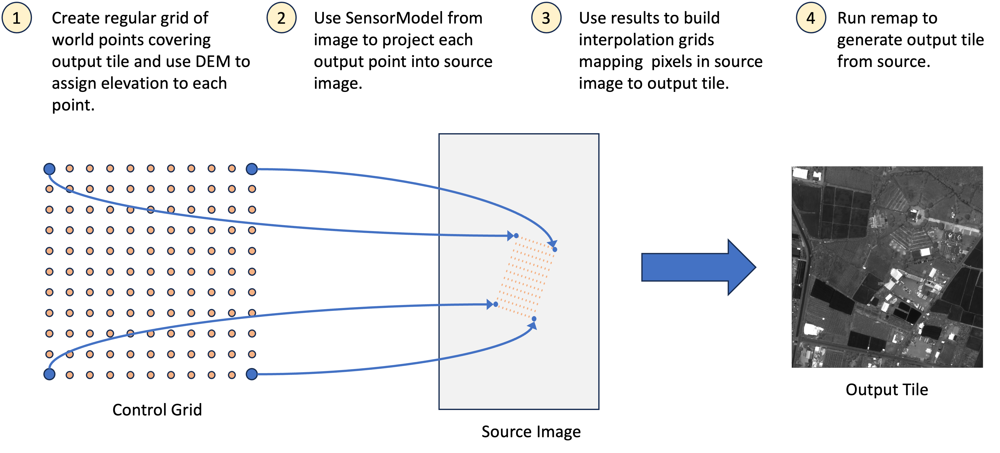

# Image Warping & Orthorectification

Raw satellite and airborne imagery is acquired in the sensor's native
geometry — a coordinate system shaped by the platform's orbit, the
sensor's viewing angle, and the terrain beneath. Pixels in this space
do not map uniformly to positions on the ground. Two types of
geometric displacement dominate:

- **Perspective displacement** — off-nadir viewing angles compress one
  side of the scene relative to the other, producing non-uniform ground
  sampling across the field of view.
- **Relief displacement** — elevated objects (buildings, hills) are
  shifted radially from the sensor's sub-satellite point. A 30-story
  building viewed 30 degrees off-nadir can be displaced several pixels
  from its true ground footprint.

Orthorectification removes both effects by projecting pixels onto a
map-accurate coordinate system using a sensor model and (optionally) a
digital elevation model. The result is a north-up, scale-consistent
image that can be overlaid on web maps, compared against other collects
for change detection, or mosaicked with neighboring scenes without
alignment artifacts.

The toolkit's warping engine uses the **indirect method** (also called
reverse mapping): for each pixel in the output grid, it applies the
inverse coordinate transformation to locate the corresponding position
in the source image. This avoids the gaps that the direct method
(source → output) would produce when output pixels fall between
projected source samples. The inverse transformation may be a single
sensor model, a chain of models (e.g. target image → world → source
image), or any mapping that converts output coordinates to source
coordinates.

Evaluating the full transformation at every output pixel is expensive,
so the engine samples a sparse **control grid** at configurable density
and interpolates the remaining positions via bilinear spline. A **grid
builder** encapsulates this process — it defines the output coordinate
system (map tiles, a projected CRS, or another image's pixel space) and
computes the control grid for each output block. The
`WarpedImageProvider` then uses the grid builder to resample source
pixels into the output geometry on demand.



## Quick Start

Generate standard web map tiles from a georegistered image:

```python
from aws.osml.io import IO
from aws.osml.metadata import load_sensor_model
from aws.osml.image_processing import (
    DisplayChainFactory,
    MapTileSetFactory,
    MappedImageProvider,
    OrthoGridBuilder,
    TiledImagePyramid,
    WarpedImageProvider,
    WarpGridOptions,
)

tile_set = MapTileSetFactory.get_for_id("WebMercatorQuad")

with IO.open("input.ntf", "r") as reader:
    source = reader.get_asset("image:0")
    sensor_model = load_sensor_model(reader)
    source_pyramid = TiledImagePyramid.from_dataset(reader)

    # Build a grid at zoom level 16
    grid_builder = OrthoGridBuilder(
        tile_set=tile_set,
        tile_matrix=16,
        sensor_model=sensor_model,
        source_width=source.num_columns,
        source_height=source.num_rows,
        options=WarpGridOptions.TERRAIN_CORRECTED,
        num_source_levels=source_pyramid.num_levels,
    )

    # Warp from the pyramid (reads at optimal resolution per block)
    warped = WarpedImageProvider(source_pyramid, grid_builder)

    # Apply display chain
    stats = source_pyramid.compute_statistics()
    chain = DisplayChainFactory.build(source, stats=stats)
    display = MappedImageProvider(
        warped, chain,
        source_bands=chain.input_bands,
        num_bands=chain.output_bands,
        pixel_value_type="uint8",
    )

    # Iterate tiles that overlap the source image
    min_row, min_col, max_row, max_col = grid_builder.tile_limits
    for tile_row in range(min_row, max_row + 1):
        for tile_col in range(min_col, max_col + 1):
            ortho_block = display.get_block(tile_row, tile_col)
            valid_mask = warped.get_valid_mask(tile_row, tile_col)
            # encode and write to z/x/y.png
```

```{figure} ../_static/images/image-warping/source_footprint.png
:width: 500
:alt: Map tile boundary projected into source image pixel coordinates

A map tile's geographic boundary projected into source image coordinates.
The non-rectangular polygon shows the sensor's oblique viewing geometry.
```

```{figure} ../_static/images/image-warping/map_overlay.png
:width: 500
:alt: Orthorectified tile overlaid on a web map

The resulting orthorectified tile overlaid on an OpenStreetMap background.
```

## Reprojecting to a Map Grid

`OrthoGridBuilder` computes the inverse mapping from output tile pixels
to source image coordinates. Pass a `MapTileSet` and tile matrix level,
and it determines which tiles overlap the source image and how to warp
each one.

### Custom Projection (ProjectedImageTileSet)

For metric-unit output (meters/pixel) or any arbitrary CRS, use
`ProjectedImageTileSet` to define a tile grid that covers the image
footprint at a given GSD:

```python
import pyproj
from aws.osml.image_processing import ProjectedImageTileSet

projected_tileset = ProjectedImageTileSet.from_sensor_model(
    sensor_model=sensor_model,
    source_width=source.num_columns,
    source_height=source.num_rows,
    target_crs=pyproj.CRS.from_epsg(32636),  # UTM Zone 36N
    gsd=0.5,  # 0.5 meters/pixel
    block_size=(1024, 1024),
)

grid_builder = OrthoGridBuilder(
    tile_set=projected_tileset,
    tile_matrix=0,  # level 0 = native GSD
    sensor_model=sensor_model,
    source_width=source.num_columns,
    source_height=source.num_rows,
    options=WarpGridOptions.TERRAIN_CORRECTED,
    num_source_levels=source_pyramid.num_levels,
)

warped = WarpedImageProvider(source_pyramid, grid_builder)

min_row, min_col, max_row, max_col = grid_builder.tile_limits
for r in range(min_row, max_row + 1):
    for c in range(min_col, max_col + 1):
        block = warped.get_block(r, c)
```

Any CRS supported by PROJ is valid — UTM, State Plane, Polar
Stereographic, Web Mercator (EPSG:3857), etc. The `gsd` is in the
CRS's native units (meters for projected, degrees for geographic).

`ProjectedImageTileSet` also supports multi-resolution levels: level N
covers 2^N x 2^N level-0 tiles at coarser resolution (same pixel
dimensions per tile, larger geographic extent). Pass `tile_matrix=1`
for 2x overview, `tile_matrix=2` for 4x, and so on.

### With Elevation Model

For terrain-corrected output, provide an elevation model. Without one,
the sensor model's default elevation (typically the mean terrain height
from image metadata) is used — adequate for flat terrain but
insufficient for mountainous areas or urban scenes with tall buildings.

```python
from aws.osml.elevation import ElevationModelBuilder, StoredDEMTileFactory
from aws.osml.photogrammetry import SRTMTileSet

elevation_model = (
    ElevationModelBuilder()
    .add_source(StoredDEMTileFactory("/path/to/srtm"), SRTMTileSet(format_extension=".dt2"))
    .add_fallback(0.0)
    .with_geoid("/path/to/egm96_15.tif")
    .build()
)

grid_builder = OrthoGridBuilder(
    tile_set=tile_set,
    tile_matrix=16,
    sensor_model=sensor_model,
    source_width=source.num_columns,
    source_height=source.num_rows,
    elevation_model=elevation_model,
    options=WarpGridOptions.TERRAIN_CORRECTED,
    num_source_levels=source_pyramid.num_levels,
)
```

```{seealso}
[Elevation Models](elevation.md) covers DEM source configuration,
geoid correction, and multi-source fallback strategies in detail.
```

## Co-Registering Two Images

When two images cover the same geographic area but were acquired at
different times, from different orbits, or by different sensors, their
pixel grids will not align. **Change detection**, **temporal stacking**,
and **multi-source fusion** all require co-registering one image into
another's pixel space so that corresponding ground locations share the
same (row, col) index.

`ImageToImageGridBuilder` produces this co-registration by chaining two
sensor models: target `image_to_world` followed by source
`world_to_image`. The result is a direct pixel-to-pixel mapping without
an intermediate map projection step — preserving the target image's
native resolution and geometry:

```python
from aws.osml.io import IO
from aws.osml.metadata import load_sensor_model
from aws.osml.image_processing import ImageToImageGridBuilder, WarpedImageProvider, WarpGridOptions

with IO.open("collect_2024.ntf", "r") as reader_a, \
     IO.open("collect_2025.ntf", "r") as reader_b:

    source_a = reader_a.get_asset("image:0")
    sm_a = load_sensor_model(reader_a)

    source_b = reader_b.get_asset("image:0")
    sm_b = load_sensor_model(reader_b)

    grid_builder = ImageToImageGridBuilder(
        source_sensor_model=sm_a,
        target_sensor_model=sm_b,
        source_width=source_a.num_columns,
        source_height=source_a.num_rows,
        target_width=source_b.num_columns,
        target_height=source_b.num_rows,
        block_width=source_b.num_pixels_per_block_horizontal,
        block_height=source_b.num_pixels_per_block_vertical,
        options=WarpGridOptions(control_points_per_side=16),
    )

    a_in_b = WarpedImageProvider(source_a, grid_builder)

    # Pixels are now co-registered — compare block-by-block
    for row in range(a_in_b.block_grid_size[0]):
        for col in range(a_in_b.block_grid_size[1]):
            block_a = a_in_b.get_block(row, col)
            block_b = source_b.get_block(row, col)
            # block_a and block_b are aligned — compute difference, etc.
```

## Validity Masks

The warped output includes a per-block validity mask indicating which
output pixels have actual source coverage:

```python
warped = WarpedImageProvider(source, grid_builder)

block = warped.get_block(0, 0)       # CHW pixel data
mask = warped.get_valid_mask(0, 0)   # (H, W) bool array

# Use mask for alpha channel
alpha = (mask * 255).astype(np.uint8)
```

Invalid pixels are zero-filled. The mask is more reliable than checking
for zero values, since legitimate source pixels may also be zero.

## Control Grid Density & Performance

The `control_points_per_side` parameter controls the accuracy vs. speed
tradeoff. Each control point requires a full sensor model evaluation
(and optionally an elevation model lookup), so doubling the density
quadruples the per-tile cost.

| Preset | Control Points | Typical Use |
|--------|---------------|-------------|
| `WarpGridOptions.FAST` | 4x4 = 16 | Real-time tile serving, previews |
| `WarpGridOptions.TERRAIN_CORRECTED` | 16x16 = 256 | Production ortho output |
| `WarpGridOptions.VISIBILITY_AWARE` | 32x32 = 1024 | High-fidelity (future) |

**Guidance:**

- **`FAST` (4x4)** — Use for interactive map viewers, thumbnails, or
  any context where sub-pixel accuracy is unnecessary. Error stays
  below 1-2 pixels for typical RPC sensor models over flat terrain.
- **`TERRAIN_CORRECTED` (16x16)** — The default. Captures terrain
  undulation within a tile and produces sub-pixel accuracy for most
  production workflows. Required when an elevation model is supplied.
- **Custom** — Construct `WarpGridOptions(control_points_per_side=N)`
  for intermediate tradeoffs. Values of 8-12 work well for moderate
  terrain with RPC models; values above 16 yield diminishing returns
  unless the sensor model is highly nonlinear (e.g. RSM with many
  polynomial terms).

| Factor | Impact | Mitigation |
|--------|--------|------------|
| Sensor model complexity | RPC models are fast; RSM/SICD slower | Use `FAST` preset for interactive work |
| Control grid density | 16x16 = 256 evaluations/block vs 4x4 = 16 | Match density to accuracy requirements |
| Block size | Larger blocks amortize setup cost | Default 1024x1024 balances memory and throughput |
| Elevation model | First DEM tile load is slow; subsequent are cached | Pre-warm cache or use constant elevation for previews |

```{tip}
For real-time tile serving, combine `WarpGridOptions.FAST` with a
`TileCache` on the `WarpedImageProvider` to avoid recomputing grids
for repeated requests to the same tile.
```

## Related Topics

```{seealso}
- [Tiling and Caching](tiling-and-caching.md) — `TileCache` and
  `RetiledImageProvider` used to normalize source layouts and cache
  decoded blocks
- [Image Pyramids](image-pyramids.md) — how to build the source
  pyramid that enables resolution-aware warping
- [Display Processing](display-processing.md) — the display chain
  applied to warped output for visualization
- [Elevation Models](elevation.md) — configuring terrain correction
  for accurate orthorectification
```
